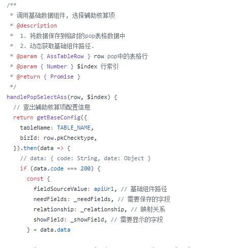
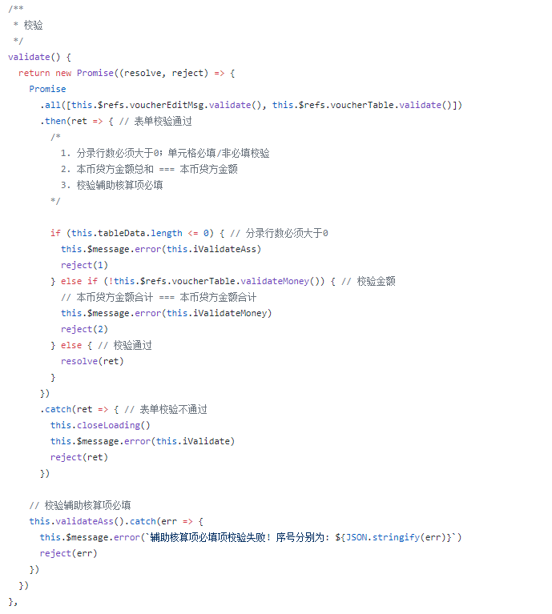
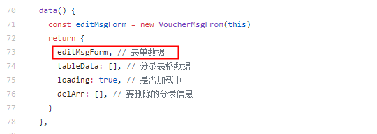
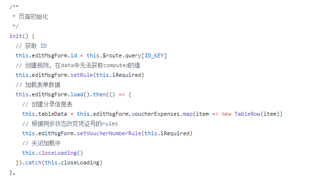

# 代码规范

> 背景: 开发一个项目的时候, 每个人都会负责对应的模块开发. 但是在项目的迭代过程中, 是很难做到让一个人一直负责他开发的模块的. 总会有新的任务安排, 人员流动等不可抗因素, 导致需要其他的同事继续开发和迭代. 特别是开发的功能是需要对自己部门外对接, 这时候规范尤其重要. 

> 对团队的好处: 
>
> 1. 开发效率的提高.
> 2. 轮岗机制打通, 功能开发不再依赖个人. 
> 3. 更容易迭代. 

> 代码规范重要的是执行而非内容. 让每个开发人员接受任务都有迹可寻.

## 代码

1. **每一行的代码的长度不能过长**, 一般是 80 - 100. 适当的换行. 
2. 代码简洁.  多了解一些语法糖, 让代码质量提高. 
3. 代码分离(业务代码和实现代码). 包括样式.
4. 统一使用 scss 或者 less. 
   1. **预编译的函数库**.
   2. 样式重置.(保持各浏览器样式的统一. Normalize.css)
5. 尽可能不让控制台报错, 多做一些**容错处理**. (提高代码的严谨性)
6. 预留属性和接口. 方便扩展使用. 
7. Vue开发中荐使用 vue 的扩展属性extends. 以及mixins混入开发, **提高代码的重用率**.
8. **要有团队自己的组件库和工具库**. 让大家都用起来. 
9. **配置抽离**.
   1. 环境变量.
   2. 类似于指标筛选的选项.
   3. 时间的格式参数. 'YYYY-MM-DD' 

## 注释

原则: 帮助他人理解代码逻辑. 所有可能有疑问的地方都要注释. 

1. 较为复杂的逻辑需要注释. 
2. 复杂的判断条件注释. 
3. 函数注释.
4. 可能有BUG的地方, 需要注意的地方都需要注释. 
5. TODO 标签的使用. 

### HTML

 

### JS

#### 1. 函数注释 

#### 2. 实现逻辑 

#### 3. 属性注释

#### 4. 主逻辑注释

## 命名

原则: 怎么容易看懂就怎么来. 

1. js采用驼峰命名.
2. css中类名使用 `-` 分割, id驼峰命名.  主题的类命名使用 `__` 分割. 
3. 自定义标签名不要与H5标签同名. 

常用的修饰词

| 修饰词   | 描述                                                         | 规则                                        |
| -------- | ------------------------------------------------------------ | ------------------------------------------- |
| on       | 例: onClick(event) 定义事件                                  | 入参要有事件对象Event.                      |
| get      | 例: getName() 获取数据                                       | 必须有返回值.                               |
| set      | 例: setName(value) 设置属性值                                | 必须有入参.                                 |
| is       | 例: isMounted(any) 判断是否找怎么                            | 返回值必须是布尔型值.                       |
| has      | 例: hasChildren(any) 是否拥有                                | 必须有入参, 返回值为布尔值.                 |
| assert   | 例: assertSuccess(boolean, callback) 断言是否成功加载, 成功执行回调. | 第一个入参是布尔值, 为true时执行后面的回调. |
| handle   | 例: handleInputClick() 用于注册事件                          | event参数最好放在最后一个参数注入.          |
| validate | 例: validateForm() 用于校验                                  | 返回值必须是布尔值或者一个Promise对象.      |

## eslint

vscode webstorm Hbuild eclipse

## Vue规范

[官方风格指南][1]

1. 父子组件命名. 

   例如: 父组件: `<Super />` 子组件: `<Super-Children>`

2. 不要使用原生的标签名命名. 例如:  `<dailog></dailog>`

## 其他

1. 单元测试

   > 自测不合格? 冒烟测试不通过? BUG反复出现? 
   >
   > 推荐在开发过程中编写单元测试. 

2. typescript

---

[1]: https://cn.vuejs.org/v2/style-guide/