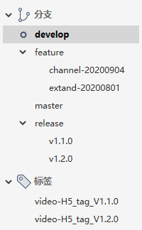

# Git 规范

在 sourceTree 中使用:




[git-流程图](./images/git-流程图.png)

```flow
st=>start: 开始
e=>end: 结束
op1=>operation: 开发 A 功能
op2=>operation: 从 develop 拉取 feature/A-20200807 分支
op3=>operation: A 功能开始开发
cd1=>condition: 测试服测试是否通过?
op4=>operation: A 功能开发结束, 从 develop 拉取 release/v1.0.0 分支, 并合入 feature/A-2020087
op5=>operation: 开发开发
op6=>operation: release/v1.0.0 分支提测
op7=>operation: 在 feature/A-2020087
分支修复 Bug 后合并
op8=>operation: 通知测试, 并备注影响范围
op9=>operation: release/v1.0.0 分支上预生产测试
op10=>operation: 打 tag 准备上线, 提前通知相关人员支持上线
op11=>operation: 上线验证, 观察服务器稳定性
cd2=>condition: 预生产测试是否通过?
cd3=>condition: 线上是否出现问题?
op12=>operation: 上线成功
op13=>operation: release/v1.0.0 分支合并到 master 分支,
master 分支合并到 develop 分支,
并隔日通知所有开发人员合并 develop 分支到当前功能分支(feature/B-20200808),
7天后删除 feature/A-2020087 分支
op14=>operation: 观察日志, 检查版本号等手段解决问题.
op15=>operation: 在 release/v1.0.0 分支修改
op16=>operation: 通知测试, 并备注影响范围.

st->op1->op2->op3->op4->op6->cd1
cd1(yes)->op9->cd2
cd1(no)->op7->op8(right)->cd1
cd2(yes)->op10->op11->cd3
cd2(no)->op15->op16(right)->cd2
cd3(yes)->op12->op13->e
cd3(no)->op14(top)->op11
op5->e
```


## Git 提交修饰词

- **feat：**提交新功能
- **fix**：修复了bug
- **docs**：只修改了文档
- **style**：调整代码格式，未修改代码逻辑（比如修改空格、格式化、缺少分号等）
- **refactor**：代码重构，既没修复bug也没有添加新功能
- **perf**：性能优化，提高性能的代码更改
- **test**：添加或修改代码测试, 单元测试
- **chore**：对构建流程或辅助工具和依赖库（如文档生成等）的更改


## Git 分支

- **master 分支**

  - 主分支，永远处于稳定状态，对应当前线上版本
  - **以 tag 标记一个版本**，因此在 master 分支上看到的每一个 tag 都应该对应一个线上版本
  - 不允许在该分支直接提交代码

- **develop 分支**

  - 开发分支，包含了项目最新的功能和代码，所有开发都依赖 develop 分支进行

  - 小的改动可以直接在 develop 分支进行，改动较多时切出新的 feature 分支进行

    **注：** 更好的做法是 **develop 分支作为开发的主分支，也不允许直接提交代码**。小改动也应该以 feature 分支提 merge request 合并，目的是保证每个改动都经过了强制代码 review，降低代码风险

- **feature 分支**

  - 功能分支，开发新功能的分支
  - 开发新的功能或者改动较大的调整，从 develop 分支切换出 feature 分支，分支名称为 `feature/xxx`
  - 开发完成上线后删除该 feature/xxx 分支

- **release 分支**

  这里有2种做法:

  1. 多版本并行开发: V1.1.0=>V1.2.0 + V1.4.0 => V1.3.0.
     - feature分支功能开发完成后, 从develop切出release分支, 并合入feature分支给测试部署.
     - develop分支基本保持稳定性(与master类似, 但可以进行一些配置的更新等提交, **更新后通知所有开发人员在开发的feature分支合入develop**).
  2. 版本线性迭代: V1.1.0=>V1.2.0=>V1.3.0.
     - 发布分支，新功能合并到 develop 分支，准备发布新版本时使用的分支.
     - 当 develop 分支完成功能合并和部分 bug fix，准备发布新版本时，切出一个 release 分支，来做发布前的准备，分支名约定为`release/xxx`
     - 发布之前发现的 bug 就直接在这个分支上修复，确定准备发版本就合并到 master 分支，完成发布，同时合并到 develop 分支

- **hotfix 分支**
- 紧急修复线上 bug 分支

  - 当线上版本出现 bug 时，从 master 分支切出一个 `hotfix/xxx` 分支，完成 bug 修复，然后将 `hotfix/xxx` 合并到 master 和 develop 分支(如果此时存在 release 分支，则应该合并到 release 分支)，合并完成后删除该 `hotfix/xxx` 分支

以上就是在项目中应该出现的分支以及每个分支功能的说明。 其中稳定长期存在的分支只有 master 和 develop 分支，别的分支在完成对应的使命之后都会合并到这两个分支然后被删除。**简单总结如下：**

- master 分支: 线上稳定版本分支
- develop 分支: 开发分支
- release 分支: 发布分支，准备待发布版本的分支，存在多个，版本发布之后删除, 也是测试分支
- feature 分支: 功能分支，完成特定功能开发的分支，存在多个，功能合并之后删除
- hotfix 分支: 紧急热修复分支，存在多个，紧急版本发布之后删除


## Git 分支命名

+ feature/(功能名)-(时间): feature/channel-20200805
+ release/(版本号)-(时间): release/V1.1.0-20200805
+ hotfix/(功能名)-(时间): hotfix/channel-20200805


## Example

### 测试的时候修复BUG.

1. BUG单不多的时候: 在feature分支上修改后合并到release分支. 通知测试部署, 并**添加备注影响范围**.
2. BUG单多的时候, 在feature分支修改好后合并到release分支. **以天为单位通知测试部署**,  并**添加备注影响范围**.


[../images/st.png]: 